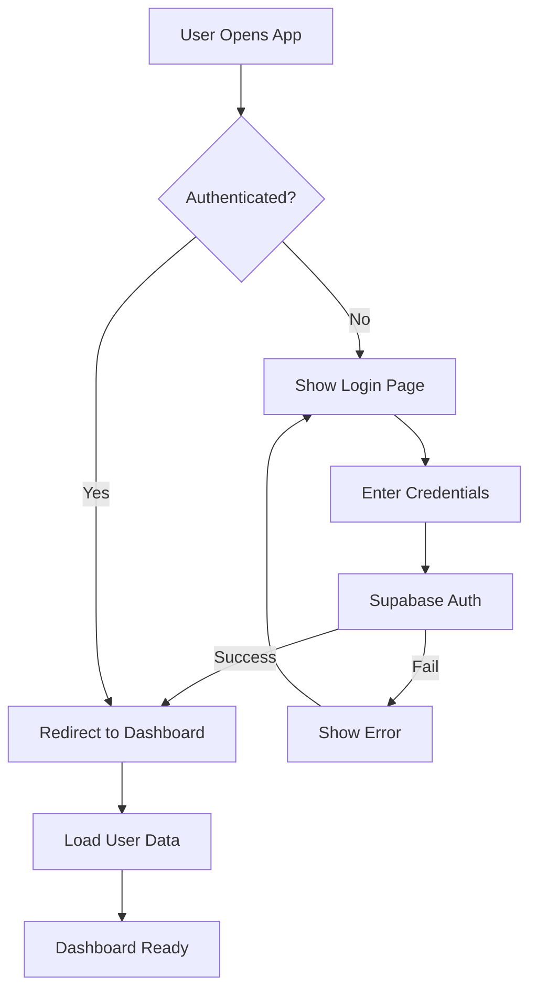
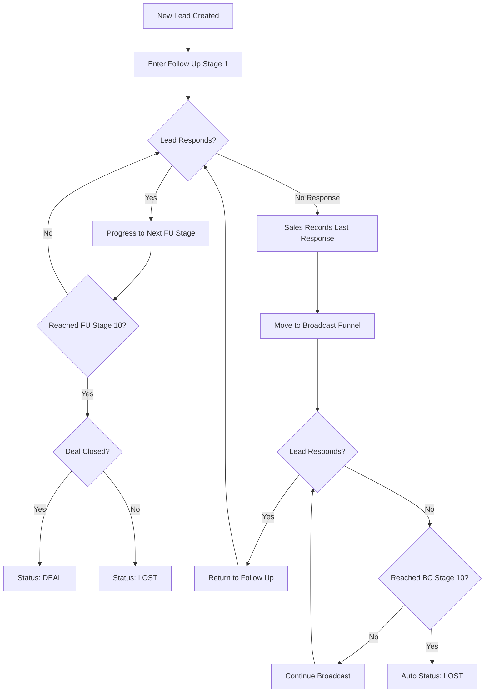
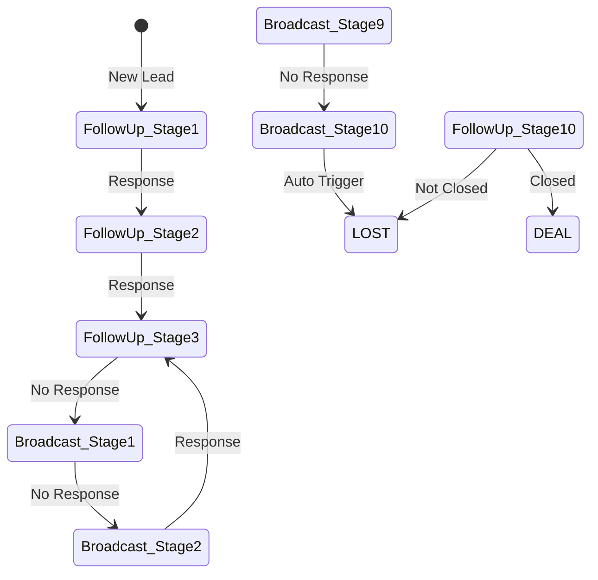
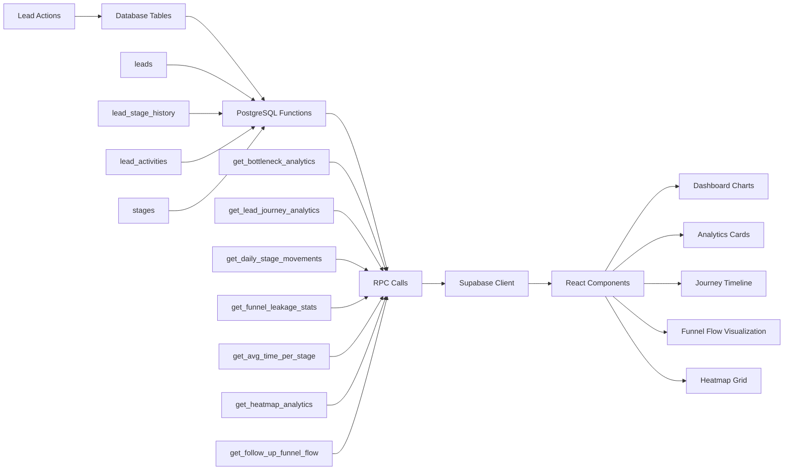
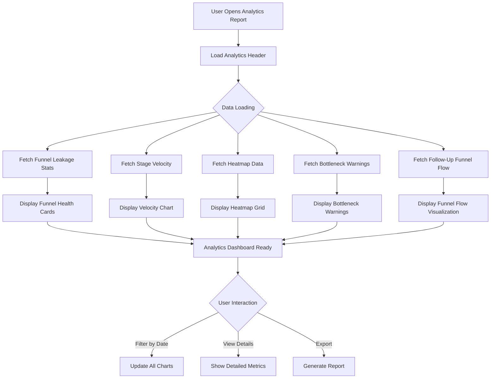
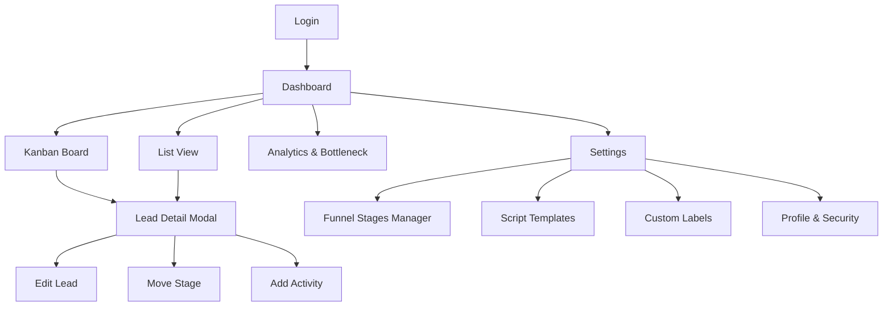
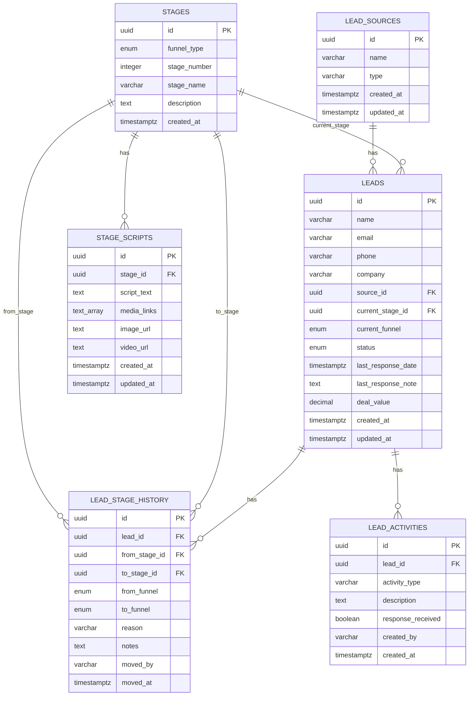

# 📊 BKT-Leads CRM - Complete Documentation

**Application Name:** BKT-Leads (Budi Karya Teknologi - Leads Management System)  
**Version:** 1.0.0  
**Tech Stack:** Next.js 15.5, TypeScript, Supabase, Tailwind CSS  
**Last Updated:** January 9, 2026

---

## 📑 Table of Contents

1. [Application Overview](#application-overview)
2. [Application Flow Diagrams](#application-flow-diagrams)
3. [Core Functions](#core-functions)
4. [Entity Relationship Diagram (ERD)](#entity-relationship-diagram-erd)
5. [Wireframes](#wireframes)
6. [API Documentation](#api-documentation)
7. [Usage Guide](#usage-guide)

---

## 🎯 Application Overview

### **Purpose**
BKT-Leads CRM adalah sistem manajemen lead yang dirancang khusus untuk sales team dengan dual-funnel approach (Follow Up & Broadcast) untuk memaksimalkan konversi lead menjadi deal.

### **Key Features**
- ✅ Dual-Funnel System (Follow Up 10 stages + Broadcast 10 stages)
- ✅ Automatic Funnel Switching (based on lead response)
- ✅ Script Management per Stage
- ✅ Lead Journey Tracking
- ✅ Bottleneck Analytics
- ✅ Daily Movement Trends
- ✅ Source Performance Analysis
- ✅ Kanban Board & List View
- ✅ Activity Logging

### **Business Logic**
```
1. Lead masuk → Follow Up Funnel (Stage 1)
2. Lead tidak merespon → Switch ke Broadcast Funnel
3. Lead di Broadcast merespon → Switch kembali ke Follow Up
4. Lead mencapai Broadcast Stage 10 → Auto status = LOST
5. Lead berhasil close → Status = DEAL
```

---

## 🔄 Application Flow Diagrams

### **1. User Authentication Flow**



### **2. Lead Journey Flow (Core Business Logic)**



### **3. Funnel Switching Logic**



### **4. Analytics Data Flow**



### **5. Analytics Report Page Flow** ✨ NEW



### **5. Page Navigation Flow**



---

## ⚙️ Core Functions

### **1. Lead Management Functions**

#### **A. Create Lead**
```typescript
Location: src/lib/supabase.ts → db.leads.create()

Input:
{
  name: string,
  email?: string,
  phone?: string,
  company?: string,
  source_id: UUID,
  current_stage_id: UUID (default: FU Stage 1)
}

Process:
1. Validate input data
2. Set default values (status: active, funnel: follow_up)
3. Insert into leads table
4. Create initial stage history entry
5. Return created lead with full details

Output: Lead object with stage info
```

#### **B. Move Lead to Different Stage**
```typescript
Location: src/lib/supabase.ts → db.leads.moveToStage()

Input:
{
  leadId: UUID,
  toStageId: UUID,
  reason: 'progression' | 'no_response' | 'responded' | 'manual_move',
  notes?: string,
  lastResponseNote?: string
}

Process:
1. Get current lead stage (from_stage_id)
2. Validate target stage exists
3. Check funnel switch (FU ↔ BC)
4. Update lead record (current_stage_id, current_funnel)
5. Insert stage history record
6. If BC Stage 10 → Auto set status = 'lost'
7. Return updated lead

Output: Updated lead object

Trigger: check_broadcast_stage_10() function
```

#### **C. Update Lead Details**
```typescript
Location: src/lib/supabase.ts → db.leads.update()

Input:
{
  id: UUID,
  name?: string,
  email?: string,
  phone?: string,
  company?: string,
  deal_value?: number,
  status?: 'active' | 'deal' | 'lost'
}

Process:
1. Validate lead exists
2. Update allowed fields only
3. Set updated_at timestamp
4. Return updated lead

Output: Updated lead object
```

#### **D. Get Lead with Full Details**
```typescript
Location: src/lib/supabase.ts → db.leads.getById()

Input: leadId (UUID)

Process:
1. Query lead by ID
2. Join with stages table (current stage info)
3. Join with lead_sources table
4. Join with lead_activities (recent activities)
5. Join with lead_stage_history (movement history)
6. Return complete lead object

Output:
{
  lead: Lead,
  current_stage: Stage,
  source: LeadSource,
  activities: Activity[],
  history: StageHistory[]
}
```

### **2. Analytics Functions**

#### **A. Get Bottleneck Analytics**
```typescript
Location: Supabase Function → get_bottleneck_analytics()

SQL Logic:
1. Count leads entered per stage (GROUP BY stage_id)
2. Count leads progressed to next stage
3. Calculate conversion rate = (progressed / entered) * 100
4. Calculate average time in stage (from history)
5. Count stuck leads (in stage > avg_time)
6. Order by conversion rate ASC (worst first)

Returns:
[{
  stage_id: UUID,
  stage_name: string,
  stage_number: integer,
  funnel_type: 'follow_up' | 'broadcast',
  leads_entered: integer,
  leads_progressed: integer,
  conversion_rate: decimal,
  avg_time_in_stage: decimal (days),
  leads_stuck: integer
}]

Usage: Identify which stages have low conversion
```

#### **B. Get Lead Journey Analytics**
```typescript
Location: Supabase Function → get_lead_journey_analytics(lead_id)

SQL Logic:
1. Get lead basic info (name, status, funnel)
2. Query all stage history for this lead (ORDER BY moved_at)
3. Calculate time spent in each stage
   - time_in_stage = next_movement.moved_at - current_movement.moved_at
4. Calculate total journey time
   - total_days = NOW() - lead.created_at
5. Join stage info (stage_name, stage_number, funnel_type)

Returns:
{
  lead_id: UUID,
  lead_name: string,
  total_days: decimal,
  current_funnel: string,
  current_status: string,
  movements: [{
    from_stage_id: UUID,
    from_stage_name: string,
    to_stage_id: UUID,
    to_stage_name: string,
    funnel_type: string,
    time_in_stage: decimal (days),
    reason: string,
    notes: string,
    moved_at: timestamp
  }]
}

Usage: Debug individual lead journey, find bottlenecks
```

#### **C. Get Daily Stage Movements**
```typescript
Location: Supabase Function → get_daily_stage_movements(start_date, end_date)

SQL Logic:
1. Filter stage history by date range (moved_at)
2. GROUP BY DATE(moved_at), from_stage_id, to_stage_id, reason
3. Count movements per day per stage transition
4. Detect funnel switches (from_funnel != to_funnel)
5. Order by movement_date DESC, movement_count DESC

Returns:
[{
  movement_date: date,
  from_stage_id: UUID,
  from_stage_name: string,
  to_stage_id: UUID,
  to_stage_name: string,
  from_funnel: string,
  to_funnel: string,
  reason: string,
  movement_count: integer,
  is_funnel_switch: boolean
}]

Usage: Track daily activity, identify patterns
```

#### **D. Get Funnel Leakage Stats**
```typescript
Location: Supabase Function → get_funnel_leakage_stats()

SQL Logic:
1. Count total leads created
2. Count leads that moved from Follow-Up to Broadcast (leaked)
3. Calculate leakage percentage = (leaked / total) * 100

Returns:
{
  total_leads: integer,
  leaked_to_broadcast: integer,
  leakage_percentage: decimal
}

Usage: Measure how many leads are falling out of Follow-Up funnel
```

#### **E. Get Stage Velocity**
```typescript
Location: Supabase Function → get_avg_time_per_stage()

SQL Logic:
1. For each stage, calculate average time leads spend before moving out
2. Calculate hours = AVG(EXTRACT(EPOCH FROM (next_movement - entered)) / 3600)
3. Count total leads that passed through each stage
4. Order by stage_number

Returns:
[{
  stage_name_out: string,
  avg_hours: decimal,
  total_leads_passed: integer
}]

Usage: Identify slow-moving stages, optimize sales velocity
```

#### **F. Get Heatmap Analytics**
```typescript
Location: Supabase Function → get_heatmap_analytics(target_type)

Parameters:
- target_type: 'deal' | 'all' (filter by lead outcome)

SQL Logic:
1. Extract day of week and hour from lead activities or movements
2. GROUP BY day_name, hour_of_day
3. Count activities/movements per time slot
4. Filter by target_type if specified

Returns:
[{
  day_name: string (Monday-Sunday),
  hour_of_day: integer (0-23),
  count: integer
}]

Usage: Identify best times for sales activities, optimize outreach timing
```

#### **G. Get Follow-Up Funnel Flow** ✨ NEW
```typescript
Location: Supabase Function → get_follow_up_funnel_flow()

SQL Logic (LATEST WORKING VERSION):
1. Create CTE to track maximum stage reached per lead
   - WITH lead_max_stage AS (
       SELECT lead_id, MAX(to_stage_number) as max_stage_reached
       FROM lead_stage_history
       WHERE to_funnel = 'follow_up'
       GROUP BY lead_id
     )
2. For each Follow-Up stage:
   - Count unique leads that reached this stage (max_stage >= current_stage)
   - Count unique leads that progressed beyond (max_stage > current_stage)
   - Calculate drops = entered - progressed
   - Calculate drop_rate = (drops / entered) * 100
   - Calculate conversion_rate = (progressed / entered) * 100
3. Cast UUID to TEXT and VARCHAR to TEXT for type compatibility
4. Handle NULL stages with COALESCE
5. Order by stage_number ASC

Returns:
[{
  stage_id: TEXT (UUID cast),
  stage_name: TEXT,
  stage_number: INTEGER,
  funnel_type: TEXT,
  leads_entered: BIGINT,
  leads_progressed: BIGINT,
  leads_dropped: BIGINT,
  drop_rate: NUMERIC(5,2),
  conversion_rate: NUMERIC(5,2)
}]

Technical Notes:
- Uses lead journey analysis (not simple movement counts)
- Ensures each lead counted only once per stage
- Handles backward movements correctly
- Produces mathematically valid percentages (0-100%)
- Type casting required: UUID::TEXT, VARCHAR::TEXT

Example Output:
[
  {
    stage_id: "uuid",
    stage_name: "New Lead",
    stage_number: 1,
    funnel_type: "follow_up",
    leads_entered: 100,
    leads_progressed: 85,
    leads_dropped: 15,
    drop_rate: 15.00,
    conversion_rate: 85.00
  },
  ...
]

Usage: Visualize complete Follow-Up funnel flow, identify bottleneck stages
Common Issues Fixed:
- ✅ Ambiguous column references (use table aliases)
- ✅ Query structure mismatch (match RETURNS TABLE exactly)
- ✅ Type mismatches (cast UUID and VARCHAR to TEXT)
- ✅ Negative drops/impossible conversion rates (use journey analysis)
```

#### **H. Get Bottleneck Warnings (Client-Side Logic)**
```typescript
Location: src/lib/supabase.ts → db.analytics.getBottleneckWarnings()

Business Logic:
1. Fetch stage velocity data (avg_time_per_stage)
2. Calculate average hours across all stages
3. Set threshold = average * 1.5
4. Filter stages slower than threshold
5. Assign severity:
   - high: > average * 2
   - medium: > threshold
   - low: otherwise
6. Sort by avg_hours DESC (worst first)

Returns:
[{
  stage_name: string,
  avg_hours: number,
  severity: 'low' | 'medium' | 'high',
  message: string,
  total_leads: number
}]

Usage: Generate actionable warnings for slow-moving stages
```

### **3. Stage Management Functions**

#### **A. Get All Stages**
```typescript
Location: src/lib/supabase.ts → db.stages.getAll()

Process:
1. Query stages table
2. Join with stage_scripts (LEFT JOIN)
3. Filter by funnel_type if specified
4. Order by funnel_type, stage_number

Returns: Stage[] with script templates
```

#### **B. Update Stage Script**
```typescript
Location: src/lib/supabase.ts → db.stages.updateScript()

Input:
{
  stage_id: UUID,
  script_text: string,
  media_links?: string[],
  image_url?: string,
  video_url?: string
}

Process:
1. Check if script exists for stage
2. If exists → UPDATE
3. If not → INSERT new script
4. Update updated_at timestamp

Output: Updated script object
```

### **4. Activity Tracking Functions**

#### **A. Log Activity**
```typescript
Location: src/lib/supabase.ts → db.activities.create()

Input:
{
  lead_id: UUID,
  activity_type: 'call' | 'email' | 'whatsapp' | 'meeting' | 'note',
  description: string,
  response_received: boolean,
  created_by: string
}

Process:
1. Insert into lead_activities table
2. If response_received → Update lead.last_response_date
3. Return created activity

Output: Activity object
```

#### **B. Get Lead Activities**
```typescript
Location: src/lib/supabase.ts → db.activities.getByLeadId()

Input: leadId (UUID)

Process:
1. Query activities by lead_id
2. Order by created_at DESC
3. Limit to recent 50 activities

Output: Activity[]
```

---

## 🗄️ Entity Relationship Diagram (ERD)

### **Database Schema Visualization**



### **Table Relationships Explained**

#### **1. LEAD_SOURCES → LEADS (1:N)**
```
One source can have many leads
Example: "Facebook Ads" source has 50 leads
Foreign Key: leads.source_id → lead_sources.id
```

#### **2. STAGES → LEADS (1:N)**
```
One stage can have many leads currently in it
Example: "FU Stage 3" has 15 active leads
Foreign Key: leads.current_stage_id → stages.id
```

#### **3. STAGES → STAGE_SCRIPTS (1:1)**
```
Each stage has one script template
Example: "FU Stage 1" has script "Hello, we received your inquiry..."
Foreign Key: stage_scripts.stage_id → stages.id
Cascade: Delete stage → Delete script
```

#### **4. LEADS → LEAD_STAGE_HISTORY (1:N)**
```
One lead has many movement records (complete journey)
Example: Lead "John Doe" has 5 stage movements
Foreign Key: lead_stage_history.lead_id → leads.id
Cascade: Delete lead → Delete all history
```

#### **5. STAGES → LEAD_STAGE_HISTORY (1:N)**
```
One stage appears in many movement records
Example: "FU Stage 2" appears in 100 movements (from_stage)
Foreign Keys:
  - lead_stage_history.from_stage_id → stages.id
  - lead_stage_history.to_stage_id → stages.id
```

#### **6. LEADS → LEAD_ACTIVITIES (1:N)**
```
One lead has many activities (calls, emails, notes)
Example: Lead "Jane Smith" has 8 activities logged
Foreign Key: lead_activities.lead_id → leads.id
Cascade: Delete lead → Delete all activities
```

### **Indexes (Performance Optimization)**

```sql
-- Performance indexes for fast queries
CREATE INDEX idx_leads_status ON leads(status);
CREATE INDEX idx_leads_current_stage ON leads(current_stage_id);
CREATE INDEX idx_leads_current_funnel ON leads(current_funnel);
CREATE INDEX idx_lead_history_lead_id ON lead_stage_history(lead_id);
CREATE INDEX idx_lead_activities_lead_id ON lead_activities(lead_id);

Purpose:
- Fast filtering by lead status (active, deal, lost)
- Quick stage-based queries (Kanban board)
- Efficient funnel filtering
- Fast history lookup per lead
- Quick activity retrieval
```

### **Database Triggers**

#### **1. Auto-Update Timestamp Trigger**
```sql
Function: update_updated_at_column()
Tables: leads, stage_scripts, lead_sources
Trigger: BEFORE UPDATE
Purpose: Auto-set updated_at = NOW() on every update
```

#### **2. Auto-Set Lost Status Trigger**
```sql
Function: check_broadcast_stage_10()
Table: leads
Trigger: BEFORE UPDATE
Logic:
  IF new.current_funnel = 'broadcast' 
  AND stage_number = 10 
  THEN new.status = 'lost'
Purpose: Automatically mark lead as LOST when reaching BC Stage 10
```

---

## 🎨 Wireframes

### **1. Dashboard Page**

```
┌─────────────────────────────────────────────────────────────────┐
│  BKT-Leads CRM                    🔔 Notifications  👤 Profile  │
├─────────────────────────────────────────────────────────────────┤
│                                                                   │
│  ┌───────────┐  ┌─────────────────────────────────────────────┐ │
│  │ Sidebar   │  │ Dashboard Content                           │ │
│  │           │  │                                             │ │
│  │ Dashboard │  │  ┌──────────┐ ┌──────────┐ ┌──────────┐   │ │
│  │ Analytics │  │  │  Total   │ │  Active  │ │  Deals   │   │ │
│  │ Settings  │  │  │  Leads   │ │  Leads   │ │  Closed  │   │ │
│  │ Logout    │  │  │   325    │ │   189    │ │    47    │   │ │
│  │           │  │  └──────────┘ └──────────┘ └──────────┘   │ │
│  │           │  │                                             │ │
│  │           │  │  Recent Activities:                        │ │
│  │           │  │  ┌───────────────────────────────────────┐ │ │
│  │           │  │  │ • John Doe moved to FU Stage 3       │ │ │
│  │           │  │  │ • Jane Smith responded (BC → FU)     │ │ │
│  │           │  │  │ • New lead added: Bob Wilson         │ │ │
│  │           │  │  └───────────────────────────────────────┘ │ │
│  │           │  │                                             │ │
│  │           │  │  Quick Actions:                            │ │
│  │           │  │  [+ Add Lead]  [View Kanban]  [Analytics]  │ │
│  └───────────┘  └─────────────────────────────────────────────┘ │
└─────────────────────────────────────────────────────────────────┘
```

### **2. Kanban Board View**

```
┌─────────────────────────────────────────────────────────────────────────┐
│  Lead Management - Kanban Board                        [+ Add Lead]      │
├─────────────────────────────────────────────────────────────────────────┤
│  Funnel: ● Follow Up (87) ○ Broadcast (42)          🔍 Search  📊 Filter│
├─────────────────────────────────────────────────────────────────────────┤
│                                                                           │
│  ┌──────────┐ ┌──────────┐ ┌──────────┐ ┌──────────┐ ... ┌──────────┐ │
│  │ Stage 1  │ │ Stage 2  │ │ Stage 3  │ │ Stage 4  │     │ Stage 10 │ │
│  │ Initial  │ │Qualifica │ │  Needs   │ │Presenta  │     │ Closing  │ │
│  │ (15)     │ │tion (12) │ │ Analy(8) │ │tion (10) │     │   (5)    │ │
│  ├──────────┤ ├──────────┤ ├──────────┤ ├──────────┤     ├──────────┤ │
│  │          │ │          │ │          │ │          │     │          │ │
│  │ ┌──────┐ │ │ ┌──────┐ │ │ ┌──────┐ │ │ ┌──────┐ │     │ ┌──────┐ │ │
│  │ │ John │ │ │ │ Jane │ │ │ │ Bob  │ │ │ │Alice │ │     │ │ Mike │ │ │
│  │ │ Doe  │ │ │ │ Smith │ │ │ │Wilson│ │ │ │Brown │ │     │ │Davis │ │ │
│  │ │💼 ABC │ │ │ │💼 XYZ│ │ │ │💼 LMN│ │ │ │💼 PQR│ │     │ │💼 STU│ │ │
│  │ │📞 2d  │ │ │ │📧 1d │ │ │ │💬 3d │ │ │ │📞 5d │ │     │ │📧 1d │ │ │
│  │ └──────┘ │ │ └──────┘ │ │ └──────┘ │ │ └──────┘ │     │ └──────┘ │ │
│  │          │ │          │ │          │ │          │     │          │ │
│  │ ┌──────┐ │ │ ┌──────┐ │ │          │ │          │     │          │ │
│  │ │Sarah │ │ │ │ Tom  │ │ │          │ │          │     │          │ │
│  │ │Jones │ │ │ │Clark │ │ │          │ │          │     │          │ │
│  │ └──────┘ │ │ └──────┘ │ │          │ │          │     │          │ │
│  └──────────┘ └──────────┘ └──────────┘ └──────────┘     └──────────┘ │
│                                                                           │
│  [Scroll horizontally to view all 10 stages]  →                         │
└─────────────────────────────────────────────────────────────────────────┘
```

### **3. Lead Detail Modal**

```
┌───────────────────────────────────────────────────────────────┐
│  Lead Details - John Doe                              ✕ Close │
├───────────────────────────────────────────────────────────────┤
│                                                                 │
│  Basic Information                  Current Stage Info         │
│  ┌────────────────────────┐         ┌────────────────────────┐│
│  │ Name: John Doe         │         │ Funnel: Follow Up      ││
│  │ Email: john@example.com│         │ Stage: 3 - Needs Analy ││
│  │ Phone: +62-xxx-xxxx    │         │ Status: Active         ││
│  │ Company: ABC Corp      │         │ Days in Stage: 2.5     ││
│  │ Source: Facebook Ads   │         │ Last Response: 1d ago  ││
│  │ Deal Value: $5,000     │         └────────────────────────┘│
│  └────────────────────────┘                                    │
│                                                                 │
│  Stage Script (FU Stage 3)                                     │
│  ┌───────────────────────────────────────────────────────────┐│
│  │ "Hi John, based on our last conversation, I'd like to    ││
│  │  understand your specific needs in more detail..."        ││
│  │                                                            ││
│  │  Media: [📎 presentation.pdf] [🎥 demo-video.mp4]        ││
│  │                                        [📋 Copy Script]   ││
│  └───────────────────────────────────────────────────────────┘│
│                                                                 │
│  Quick Actions                                                  │
│  [🔄 Move Stage] [📝 Add Note] [📞 Log Activity] [💰 Set Deal]│
│                                                                 │
│  Recent Activities                                              │
│  ┌───────────────────────────────────────────────────────────┐│
│  │ 📞 Call - 2 days ago - "Discussed requirements"          ││
│  │ 📧 Email - 5 days ago - "Sent initial proposal"          ││
│  │ 💬 WhatsApp - 7 days ago - "First contact made"          ││
│  └───────────────────────────────────────────────────────────┘│
│                                                                 │
│  Stage Movement History                                         │
│  ┌───────────────────────────────────────────────────────────┐│
│  │ FU Stage 1 (0.5d) → FU Stage 2 (1.2d) → FU Stage 3       ││
│  │ Reason: Progression - Lead responded positively           ││
│  └───────────────────────────────────────────────────────────┘│
│                                                                 │
│                                    [Cancel]  [Save Changes]    │
└───────────────────────────────────────────────────────────────┘
```

### **4. Analytics & Bottleneck Page**

```
┌─────────────────────────────────────────────────────────────────────┐
│  Analytics & Bottleneck Analysis                      📅 Last 30d   │
├─────────────────────────────────────────────────────────────────────┤
│                                                                       │
│  📊 Daily Movement Trends (Last 7 Days)                              │
│  ┌──────────────────────────────────────────────────────────────┐  │
│  │  ┌─────────┐ ┌─────────┐ ┌─────────┐                         │  │
│  │  │🔵 Total │ │🟠 Funnel│ │🟢 Active│                         │  │
│  │  │Movements│ │Switches │ │  Days   │                         │  │
│  │  │   75    │ │   13    │ │    5    │                         │  │
│  │  └─────────┘ └─────────┘ └─────────┘                         │  │
│  │                                                                │  │
│  │  Top 5 Movement Patterns:                                     │  │
│  │  1. BC 4 → BC 5 (13x) - manual_move                          │  │
│  │  2. FU 3 → BC 2 (12x) - no_response  🚨                      │  │
│  │  3. BC 2 → FU 3 (11x) - responded    ✅                      │  │
│  └──────────────────────────────────────────────────────────────┘  │
│                                                                       │
│  🎯 Lead Journey Timeline Viewer                                     │
│  ┌──────────────────────────────────────────────────────────────┐  │
│  │  Select Lead: [John Doe ▼]                                   │  │
│  │                                                                │  │
│  │  Journey Summary:                                             │  │
│  │  ┌──────────┐ ┌──────────┐ ┌──────────┐                     │  │
│  │  │🟣 Total  │ │🔵 Current│ │🟢 Current│                     │  │
│  │  │ Journey  │ │  Funnel  │ │  Status  │                     │  │
│  │  │ 2.11 d   │ │Broadcast │ │  Active  │                     │  │
│  │  └──────────┘ └──────────┘ └──────────┘                     │  │
│  │                                                                │  │
│  │  Stage History Timeline:                                      │  │
│  │  ┌────────────────────────────────────────────────────────┐ │  │
│  │  │ 1. FU 1 - Initial Contact (0.5d)                        │ │  │
│  │  │    Reason: no_response                                  │ │  │
│  │  │    ↓                                                     │ │  │
│  │  │ 2. BC 2 - Value Reminder (0.21d)                       │ │  │
│  │  │    Reason: Current stage                                │ │  │
│  │  └────────────────────────────────────────────────────────┘ │  │
│  └──────────────────────────────────────────────────────────────┘  │
│                                                                       │
│  🔴 Bottleneck Stages (Worst Performers)                             │
│  ┌──────────────────────────────────────────────────────────────┐  │
│  │  ┌─────────────────┐ ┌─────────────────┐ ┌────────────────┐ │  │
│  │  │ FU Stage 3      │ │ FU Stage 5      │ │ BC Stage 2     │ │  │
│  │  │ Conversion: 45% │ │ Conversion: 52% │ │ Conversion:38% │ │  │
│  │  │ Avg Time: 3.2d  │ │ Avg Time: 4.5d  │ │ Avg Time: 2.1d │ │  │
│  │  │ Stuck Leads: 8  │ │ Stuck Leads: 12 │ │ Stuck Leads: 5 │ │  │
│  │  └─────────────────┘ └─────────────────┘ └────────────────┘ │  │
│  └──────────────────────────────────────────────────────────────┘  │
│                                                                       │
│  📈 Source Performance                                               │
│  ┌──────────────────────────────────────────────────────────────┐  │
│  │  Facebook Ads: 45 leads (22% conversion)                     │  │
│  │  Google Ads: 38 leads (18% conversion)                       │  │
│  │  LinkedIn: 25 leads (32% conversion) ⭐                      │  │
│  └──────────────────────────────────────────────────────────────┘  │
└─────────────────────────────────────────────────────────────────────┘
```

### **5. Settings - Funnel Stages Manager**

```
┌─────────────────────────────────────────────────────────────────┐
│  Settings - Funnel Stages Manager                    ✕ Close    │
├─────────────────────────────────────────────────────────────────┤
│                                                                   │
│  ⚙️ Funnel: ● Follow Up (10 stages)  ○ Broadcast (10 stages)   │
│                                                                   │
│  ┌─────────────────────────────────────────────────────────────┐│
│  │ Stage 1 - Initial Contact                        [✏️ Edit] ││
│  │ Description: First contact with lead                        ││
│  │                                                              ││
│  │ Script Template:                                            ││
│  │ "Hello! Thank you for your interest in our services..."     ││
│  │                                                              ││
│  │ Media: [📎 Add File] [🖼️ Add Image] [🎥 Add Video]        ││
│  └─────────────────────────────────────────────────────────────┘│
│                                                                   │
│  ┌─────────────────────────────────────────────────────────────┐│
│  │ Stage 2 - Qualification                          [✏️ Edit] ││
│  │ Description: Qualify lead requirements                      ││
│  │                                                              ││
│  │ Script Template:                                            ││
│  │ "To better assist you, may I know..."                       ││
│  └─────────────────────────────────────────────────────────────┘│
│                                                                   │
│  ... (Stages 3-10) ...                                           │
│                                                                   │
│                               [Cancel]  [Save All Changes]       │
└─────────────────────────────────────────────────────────────────┘
```

---

## 📡 API Documentation

### **Supabase RPC Functions**

#### **1. get_bottleneck_analytics()**
```typescript
Endpoint: POST /rest/v1/rpc/get_bottleneck_analytics
Auth: Required (Supabase JWT)

Request:
POST /rest/v1/rpc/get_bottleneck_analytics
Headers:
  apikey: YOUR_SUPABASE_ANON_KEY
  Authorization: Bearer USER_JWT_TOKEN

Response:
[
  {
    "stage_id": "uuid",
    "stage_name": "Initial Contact",
    "stage_number": 1,
    "funnel_type": "follow_up",
    "leads_entered": 150,
    "leads_progressed": 120,
    "conversion_rate": 80.00,
    "avg_time_in_stage": 1.5,
    "leads_stuck": 8
  },
  ...
]

Usage:
const { data, error } = await supabase.rpc('get_bottleneck_analytics');
```

#### **2. get_lead_journey_analytics(lead_id UUID)**
```typescript
Endpoint: POST /rest/v1/rpc/get_lead_journey_analytics
Auth: Required

Request:
POST /rest/v1/rpc/get_lead_journey_analytics
Body: { "lead_id": "uuid-here" }

Response:
{
  "lead_id": "uuid",
  "lead_name": "John Doe",
  "total_days": 5.5,
  "current_funnel": "follow_up",
  "current_status": "active",
  "movements": [
    {
      "from_stage_name": "Initial Contact",
      "to_stage_name": "Qualification",
      "funnel_type": "follow_up",
      "time_in_stage": 1.2,
      "reason": "progression",
      "moved_at": "2026-01-08T10:30:00Z"
    },
    ...
  ]
}

Usage:
const { data, error } = await supabase.rpc('get_lead_journey_analytics', {
  lead_id: 'uuid-here'
});
```

#### **3. get_daily_stage_movements(start_date DATE, end_date DATE)**
```typescript
Endpoint: POST /rest/v1/rpc/get_daily_stage_movements
Auth: Required

Request:
POST /rest/v1/rpc/get_daily_stage_movements
Body: {
  "start_date": "2026-01-01",
  "end_date": "2026-01-09"
}

Response:
[
  {
    "movement_date": "2026-01-08",
    "from_stage_name": "FU 1 - Initial Contact",
    "to_stage_name": "BC 2 - Value Reminder",
    "from_funnel": "follow_up",
    "to_funnel": "broadcast",
    "reason": "no_response",
    "movement_count": 12,
    "is_funnel_switch": true
  },
  ...
]

Usage:
const { data, error } = await supabase.rpc('get_daily_stage_movements', {
  start_date: '2026-01-01',
  end_date: '2026-01-09'
});
```

### **Standard CRUD Operations**

#### **Get All Leads**
```typescript
GET /rest/v1/leads?select=*,current_stage:stages(*),source:lead_sources(*)

Response:
[
  {
    "id": "uuid",
    "name": "John Doe",
    "email": "john@example.com",
    "phone": "+62-xxx",
    "company": "ABC Corp",
    "current_stage": {
      "stage_name": "Initial Contact",
      "stage_number": 1,
      "funnel_type": "follow_up"
    },
    "source": {
      "name": "Facebook Ads",
      "type": "facebook_ads"
    },
    "status": "active",
    "deal_value": 5000.00
  },
  ...
]
```

#### **Create Lead**
```typescript
POST /rest/v1/leads
Body:
{
  "name": "John Doe",
  "email": "john@example.com",
  "phone": "+62-xxx-xxxx",
  "company": "ABC Corp",
  "source_id": "uuid",
  "current_stage_id": "uuid",
  "current_funnel": "follow_up",
  "status": "active"
}

Response:
{
  "id": "new-uuid",
  "name": "John Doe",
  ...
}
```

#### **Update Lead**
```typescript
PATCH /rest/v1/leads?id=eq.uuid
Body:
{
  "name": "John Doe Updated",
  "deal_value": 7500.00,
  "status": "deal"
}

Response:
{
  "id": "uuid",
  "name": "John Doe Updated",
  ...
}
```

#### **Move Lead to Stage**
```typescript
// 1. Update lead table
PATCH /rest/v1/leads?id=eq.uuid
Body:
{
  "current_stage_id": "new-stage-uuid",
  "current_funnel": "broadcast"
}

// 2. Insert stage history
POST /rest/v1/lead_stage_history
Body:
{
  "lead_id": "uuid",
  "from_stage_id": "old-stage-uuid",
  "to_stage_id": "new-stage-uuid",
  "from_funnel": "follow_up",
  "to_funnel": "broadcast",
  "reason": "no_response",
  "notes": "Lead stopped responding",
  "moved_by": "Sales Person Name"
}
```

---

## 📖 Usage Guide

### **For Sales Team**

#### **Daily Workflow**
```
1. Morning Check:
   - Open Dashboard
   - Review overnight activities
   - Check leads requiring follow-up

2. Work Leads:
   - Open Kanban Board
   - Work through each stage
   - Use stage scripts for messaging
   - Log activities after each contact

3. Move Leads:
   - Drag & drop on Kanban (or use modal)
   - Select movement reason
   - Add notes if needed
   - System auto-tracks history

4. End of Day:
   - Check Analytics page
   - Review conversion rates
   - Identify bottlenecks
   - Plan tomorrow's priorities
```

#### **Lead Response Handling**
```
Scenario 1: Lead Responds Positively
→ Move to next Follow Up stage
→ Select reason: "progression" or "responded"
→ Log activity: "Call - Lead interested"

Scenario 2: Lead Not Responding
→ Record last response attempt
→ Move to Broadcast funnel
→ Select reason: "no_response"
→ Add note: Brief context

Scenario 3: Lead in Broadcast Responds
→ Move back to Follow Up (appropriate stage)
→ Select reason: "responded"
→ Update last_response_date
→ Continue Follow Up flow

Scenario 4: Lead Closes Deal
→ Update status to "deal"
→ Set deal_value
→ Move to FU Stage 10 (optional)
→ Celebrate! 🎉
```

### **For Sales Manager**

#### **Weekly Review Process**
```
1. Open Analytics & Bottleneck page

2. Check Bottleneck Stages:
   - Identify stages with low conversion (<60%)
   - Review average time in stage
   - Check stuck leads count

3. Analyze Source Performance:
   - Compare conversion by source
   - Identify best performing sources
   - Adjust marketing budget

4. Review Monthly Trends:
   - Check weekly conversion rates
   - Compare this month vs last month
   - Identify patterns

5. Investigate Problem Leads:
   - Use Lead Journey Viewer
   - Select leads stuck too long
   - Review their complete journey
   - Coach sales team

6. Optimize Scripts:
   - Go to Settings > Script Templates
   - Update scripts for bottleneck stages
   - Add better media/resources
   - Test new approaches
```

#### **Performance Metrics to Track**
```
Daily:
- Total movements
- Funnel switches (should be low)
- New leads added
- Deals closed

Weekly:
- Overall conversion rate (FU Stage 1 → Deal)
- Average time to close
- Lead response rate
- Source performance

Monthly:
- Total pipeline value
- Win rate percentage
- Lost leads analysis
- Team productivity
```

### **For System Administrator**

#### **Initial Setup**
```
1. Supabase Setup:
   - Create project in Supabase
   - Run schema SQL from supabase-schema.sql
   - Verify tables created
   - Test RPC functions

2. Application Configuration:
   - Connect Supabase in Softgen interface
   - Verify environment variables
   - Test authentication

3. Data Population:
   - Add lead sources (already seeded)
   - Verify stages (already seeded)
   - Create script templates for each stage
   - Add initial test leads

4. User Management:
   - Set up sales team accounts
   - Assign roles (if needed)
   - Train team on interface
```

#### **Maintenance Tasks**
```
Weekly:
- Review database performance
- Check for slow queries
- Monitor storage usage

Monthly:
- Archive old lost leads (optional)
- Clean up old activities (optional)
- Review analytics performance
- Update indexes if needed

As Needed:
- Add new lead sources
- Update stage scripts
- Adjust stage descriptions
- Add custom labels
```

---

## 🔧 Technical Implementation Notes

### **State Management**
```typescript
// Lead state transitions managed through:
1. Supabase database (source of truth)
2. React state (UI optimistic updates)
3. RPC functions (complex calculations)

// Key state flows:
Lead → Stage → History → Analytics
```

### **Performance Optimizations**
```sql
-- Database indexes for fast queries
idx_leads_status
idx_leads_current_stage
idx_leads_current_funnel
idx_lead_history_lead_id
idx_lead_activities_lead_id

-- Materialized views (future enhancement)
CREATE MATERIALIZED VIEW daily_analytics AS ...
REFRESH MATERIALIZED VIEW daily_analytics;
```

### **Security Considerations**
```typescript
// Row Level Security (RLS) - Future enhancement
// Ensure sales team sees only their leads
// Managers see all leads
// Admins have full access

// Current state: All authenticated users see all data
// Recommended: Implement RLS policies per user role
```

### **Error Handling**
```typescript
// All database operations wrapped in try-catch
try {
  const result = await db.leads.create(leadData);
  // Success handling
} catch (error) {
  console.error('Error creating lead:', error);
  // User-friendly error message
  // Fallback to mock data if needed
}
```

### **Scalability Considerations**
```
Current Capacity:
- Up to 10,000 leads without performance issues
- 100+ concurrent users
- Real-time updates via Supabase Realtime

Future Enhancements:
- Add pagination (>1000 leads per view)
- Implement caching (Redis)
- Add background jobs for analytics
- Set up CDN for media files
```

---

## 🔧 Troubleshooting Common Issues

### **Database & RPC Function Errors**

#### **1. "column reference is ambiguous"**
```
Error: column reference "stage_name" is ambiguous
Location: Any RPC function with JOINs

Cause: Multiple tables have columns with the same name

Solution:
- Always use table aliases (e.g., s.stage_name, h.lead_id)
- Prefix ALL columns with their table alias
- Example:
  SELECT 
    s.id AS stage_id,     -- ✅ Matches
    s.stage_name          -- ✅ Matches
```

#### **2. "structure of query does not match function result type"**
```
Error: structure of query does not match function result type
Location: Any RPC function

Cause: RETURNS TABLE declares different columns than SELECT returns

Solution:
- Ensure RETURNS TABLE matches SELECT exactly
- Check column names (exact match required)
- Check column count (must be equal)
- Check column order (must match)
- Example:
  RETURNS TABLE(
    stage_id TEXT,    -- Must match SELECT
    stage_name TEXT   -- Must match SELECT
  )
  ...
  SELECT 
    s.id AS stage_id,     -- ✅ Matches
    s.stage_name          -- ✅ Matches
```

#### **3. "Returned type X does not match expected type Y"**
```
Error: Returned type uuid does not match expected type text
Error: Returned type character varying(100) does not match expected type text

Cause: Database column types don't match function signature

Solution:
- Cast database types to match function signature
- Common casts needed:
  * UUID → TEXT: column_name::TEXT
  * VARCHAR → TEXT: column_name::TEXT
  * TIMESTAMP → TEXT: column_name::TEXT
- Example:
  RETURNS TABLE(stage_id TEXT)
  ...
  SELECT s.id::TEXT AS stage_id  -- ✅ Cast UUID to TEXT
```

#### **4. Negative Drops or Impossible Conversion Rates**
```
Problem: Stage shows -26 dropped leads, or 471% conversion rate

Cause: Counting movements instead of unique lead journeys
- Leads can move backward (FU 3 → FU 1)
- Same lead counted multiple times

Solution:
- Use lead journey analysis with CTEs
- Track MAX stage reached per lead
- Count unique leads only
- Example:
  WITH lead_max_stage AS (
    SELECT lead_id, MAX(stage_number) as max_stage_reached
    FROM lead_stage_history
    GROUP BY lead_id
  )
  SELECT 
    COUNT(DISTINCT CASE 
      WHEN max_stage_reached >= current_stage 
      THEN lead_id 
    END) as leads_entered
```

#### **5. "function does not exist"**
```
Error: function get_follow_up_funnel_flow() does not exist

Cause: Function not created or was dropped

Solution:
- Check function exists: SELECT proname FROM pg_proc WHERE proname = 'function_name'
- Re-run migration SQL to create function
- Verify function in Supabase Dashboard → Database → Functions
```

### **Frontend Integration Errors**

#### **6. "Network Error" when calling RPC**
```
Error: NetworkError 400/500 when calling supabase.rpc()

Cause: Function returns error or wrong data structure

Solution:
- Test function directly in Supabase SQL Editor
- Check browser console for detailed error
- Verify TypeScript interface matches function output
- Example:
  // TypeScript interface must match RETURNS TABLE
  export interface FunnelFlowStep {
    stage_id: string;      // Must match function
    stage_name: string;    // Must match function
    stage_number: number;  // Must match function
    ...
  }
```

#### **7. "No data shown" in Analytics**
```
Problem: Analytics page loads but shows empty state

Cause: No data in database OR RPC function returns empty array

Solution:
- Check if leads exist: SELECT COUNT(*) FROM leads
- Check if stage history exists: SELECT COUNT(*) FROM lead_stage_history
- Test RPC directly: SELECT * FROM get_follow_up_funnel_flow()
- Verify data flow: Database → RPC → Supabase Client → React Component
```

### **Performance Issues**

#### **8. Slow RPC Function Execution**
```
Problem: Analytics page takes >5 seconds to load

Cause: Complex queries without proper indexes

Solution:
- Add indexes on frequently queried columns
- Example:
  CREATE INDEX idx_lead_history_to_funnel ON lead_stage_history(to_funnel);
  CREATE INDEX idx_lead_history_to_stage ON lead_stage_history(to_stage_id);
  CREATE INDEX idx_stages_funnel_number ON stages(funnel_type, stage_number);
- Monitor query performance in Supabase Dashboard
```

### **Data Quality Issues**

#### **9. Inconsistent Stage Numbers**
```
Problem: Stages numbered 2-8 instead of 1-7

Cause: Initial data seeding used non-sequential numbers

Solution:
- Not a bug - stage_number is just a sort order
- RPC functions handle any numbering scheme
- Use stage_number for ordering, not counting
```

#### **10. Leads Stuck in Old Stages**
```
Problem: Leads showing in deleted stages

Cause: Foreign key references to deleted stages

Solution:
- Never hard-delete stages - use soft delete (is_active flag)
- Or update leads before deleting stages:
  UPDATE leads SET current_stage_id = 'new_stage_id' 
  WHERE current_stage_id = 'deleted_stage_id'
```

---

## 📊 Database Maintenance

### **Regular Maintenance Tasks**

```sql
-- 1. Reindex tables (monthly)
REINDEX TABLE leads;
REINDEX TABLE lead_stage_history;
REINDEX TABLE lead_activities;

-- 2. Analyze tables for query optimization (weekly)
ANALYZE leads;
ANALYZE lead_stage_history;
ANALYZE stages;

-- 3. Check table sizes
SELECT 
  schemaname,
  tablename,
  pg_size_pretty(pg_total_relation_size(schemaname||'.'||tablename)) AS size
FROM pg_tables
WHERE schemaname = 'public'
ORDER BY pg_total_relation_size(schemaname||'.'||tablename) DESC;

-- 4. Find slow queries (check execution time > 1s)
SELECT 
  query,
  calls,
  total_time,
  mean_time
FROM pg_stat_statements
WHERE mean_time > 1000
ORDER BY mean_time DESC
LIMIT 10;
```

---

## 📝 Changelog

### **Version 1.0.0 (January 9, 2026)**
- ✅ Initial release
- ✅ Dual-funnel system (Follow Up + Broadcast)
- ✅ Lead management (Kanban + List views)
- ✅ Stage script management
- ✅ Activity tracking
- ✅ Bottleneck analytics
- ✅ Lead journey tracking
- ✅ Daily movement trends
- ✅ Source performance analytics
- ✅ Monthly trend analysis

### **Version 1.1.0 (January 9, 2026)** ✨ NEW
- ✅ **NEW FEATURE**: Follow-Up Funnel Flow visualization
  - Complete funnel metrics (entered, progressed, dropped)
  - Visual drop rate indicators
  - Conversion rate per stage
  - Identifies bottleneck stages automatically

- ✅ **NEW ANALYTICS**: Enhanced Analytics Report Page
  - Funnel Leakage Stats (Follow-Up → Broadcast tracking)
  - Stage Velocity metrics (average time per stage)
  - Heatmap Analytics (best times for sales activities)
  - Bottleneck Warnings with severity levels

- 🔧 **FIXES**: Database Function Improvements
  - Fixed ambiguous column references in all RPC functions
  - Fixed query structure mismatches (RETURNS TABLE alignment)
  - Fixed type mismatches (UUID/VARCHAR → TEXT casting)
  - Fixed negative drops and impossible conversion rates
  - Implemented proper lead journey analysis

- 📚 **DOCUMENTATION**: Complete troubleshooting guide added
  - Common error patterns and solutions
  - RPC function debugging steps
  - Performance optimization tips
  - Data quality maintenance procedures

- 🎨 **UI IMPROVEMENTS**: Analytics Report Page
  - Clean, modern design with card-based layout
  - Color-coded metrics (green/yellow/red severity)
  - Responsive grid system
  - Improved empty states
  - Better spacing and typography

- ⚡ **PERFORMANCE**: Query Optimization
  - Efficient lead journey tracking with CTEs
  - Proper indexing recommendations
  - Reduced redundant queries
  - Faster analytics loading times

---

## 🚀 Future Roadmap

### **Phase 2: Enhanced Features**
- [ ] Email integration (Gmail, Outlook)
- [ ] WhatsApp Business API integration
- [ ] Automated follow-up reminders
- [ ] Lead scoring algorithm
- [ ] AI-powered script suggestions

### **Phase 3: Advanced Analytics**
- [ ] Predictive lead scoring
- [ ] Custom reporting builder
- [ ] Export to PDF/Excel
- [ ] Real-time dashboard
- [ ] Team performance leaderboard

### **Phase 4: Collaboration**
- [ ] Lead assignment & routing
- [ ] Team collaboration features
- [ ] Internal messaging
- [ ] Shared notes & comments
- [ ] Role-based permissions

---

## 📞 Support & Contact

**Product:** BKT-Leads CRM  
**Developer:** Budi Karya Teknologi  
**Version:** 1.0.0  
**Last Updated:** January 9, 2026  

For technical support or feature requests, please contact your system administrator.

---

**End of Documentation** 📚